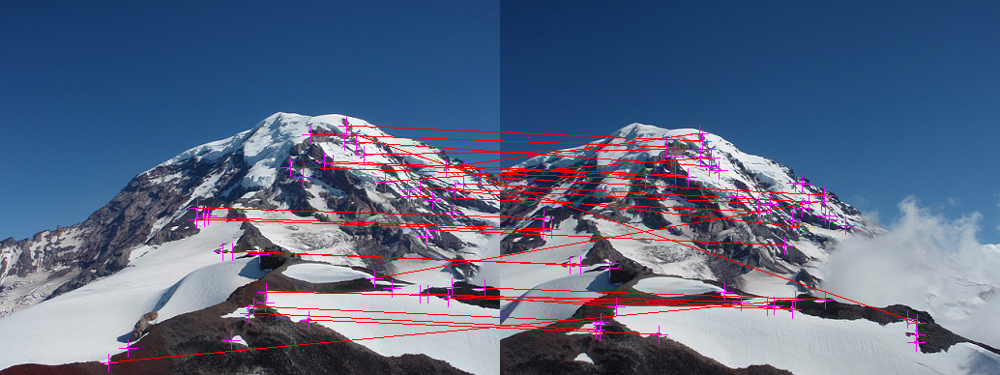

# Panaroma-Image-Stitching-using-Harris-feature-detection-and-matching
An implementation of an image stitching algorithm widely used for building Panaromas using C

This implementation is part of the course "Ancient Secrets of Computer Vision" taught by Joseph Redmon [link to course](https://pjreddie.com/courses/computer-vision/).

## Input

  

## Harris Corner Detection

## Stitched Image with corner matches

